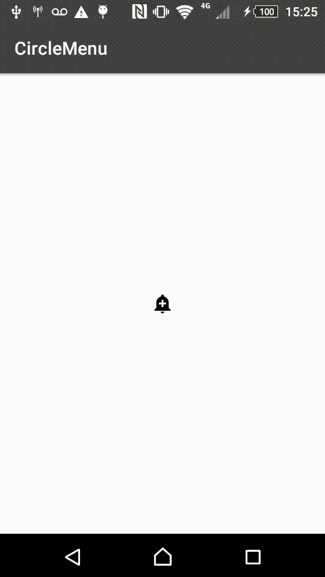
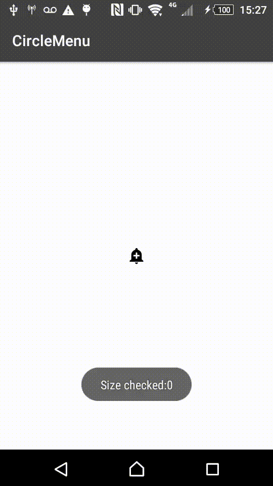

# CircleMenu


A customization of the lib https://github.com/ImangazalievM/CircleMenu

# Demo

<p align="center">
  
  
</p>

# Setup

Add this to your app build.gradle:

```gradle

allprojects {
  repositories {
    ...
    maven { url 'https://jitpack.io' }
  }
}

dependencies {
    compile 'com.github.safetysystemtechnology:CircleMenu:1.0.9'
}

```

# Usage

### XML

```xml
<com.imangazaliev.circlemenu.CircleMenu
    android:id="@+id/circle_menu_multiple_border"
    android:layout_width="wrap_content"
    android:layout_height="wrap_content"
    android:layout_centerInParent="true"
    app:hintsEnabled="true"
    app:multiple_check="true"
    app:alpha_check="false"
    app:border_check="true"
    app:center_drawable="@drawable/ic_add_alert_black_24dp"
    app:confirmation_center_drawable="@drawable/ic_send_red">
</com.imangazaliev.circlemenu.CircleMenu>
```
### Java

```java
final CircleMenu circleMenuMultiple = (CircleMenu) findViewById(R.id.circle_menu_multiple_border);

/**
 * adding dynamically
 */
for (int i = 0; i < 4; i ++) {

    CircleMenuText circleMenuText = new CircleMenuText(this);
    circleMenuText.setMetaData(new ExampleData(i));

    circleMenuText.setIconResId(R.drawable.ic_favorite);
    circleMenuText.setFullDrawable(false);
    circleMenuText.setEnableBorder(true);
    circleMenuText.setClickable(false);
    circleMenuText.setColorBorder(Color.RED);

    circleMenuText.setTitle("NetoDevel");
    circleMenuText.setTitleColor(Color.BLACK);
    circleMenuMultiple.addButton(circleMenuText);
}

/**
 * get meta data of circles selected
 */
circleMenuMultiple.setOnConfirmationListener(new CircleMenu.OnConfirmationListener() {
    @Override
    public void onConfirmation(List<Object> listData) {
        Toast.makeText(getBaseContext(), "Size checked:" + listData.size(), Toast.LENGTH_SHORT).show();
        for (int i =0; i< listData.size(); i++ ) {
            ExampleData exampleData = (ExampleData) listData.get(i);
            Log.d("MainActivity", "Id: " + exampleData.getId());
        }
    }
});
```

### Multiple checks attributes on Circle Menu

* `app:multiple_check` : Enables the multiple_check selection (Default: `false`)
* `app:border_check="true"`: Enable animation border
* `app:alpha_check="false"`: Enable animation alpha
* `app:center_drawable` : Path to your custom graphic resource
* `app:confirmation_center_drawable` : Path to your custom confirmation button graphic resource

### Attributes on Circle Menu Text

* `app:enable_border` : Enable animation border
* `app:full_drawable` : When you want to draw in full circle


## License

The MIT License

Copyright (c) 2016 Mahach Imangazaliev

Permission is hereby granted, free of charge, to any person obtaining a copy of this software and associated documentation files (the "Software"), to deal in the Software without restriction, including without limitation the rights to use, copy, modify, merge, publish, distribute, sublicense, and/or sell copies of the Software, and to permit persons to whom the Software is furnished to do so, subject to the following conditions:

The above copyright notice and this permission notice shall be included in all copies or substantial portions of the Software.

THE SOFTWARE IS PROVIDED "AS IS", WITHOUT WARRANTY OF ANY KIND, EXPRESS OR IMPLIED, INCLUDING BUT NOT LIMITED TO THE WARRANTIES OF MERCHANTABILITY, FITNESS FOR A PARTICULAR PURPOSE AND NONINFRINGEMENT. IN NO EVENT SHALL THE AUTHORS OR COPYRIGHT HOLDERS BE LIABLE FOR ANY CLAIM, DAMAGES OR OTHER LIABILITY, WHETHER IN AN ACTION OF CONTRACT, TORT OR OTHERWISE, ARISING FROM, OUT OF OR IN CONNECTION WITH THE SOFTWARE OR THE USE OR OTHER DEALINGS IN THE SOFTWARE.
